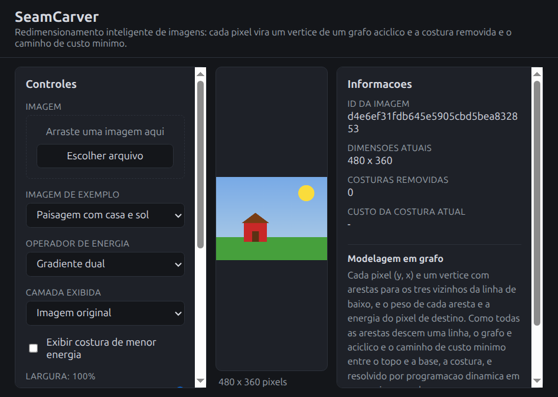
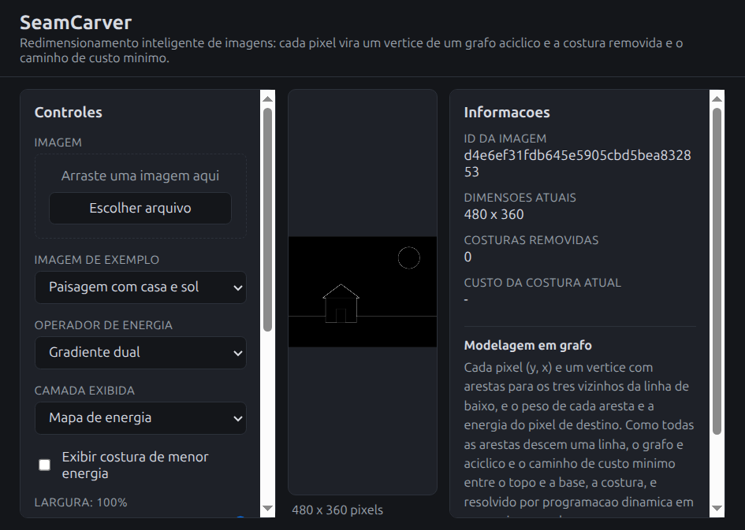
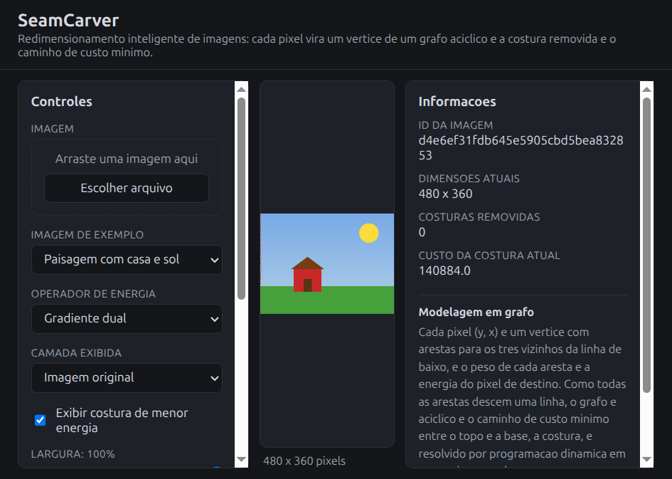
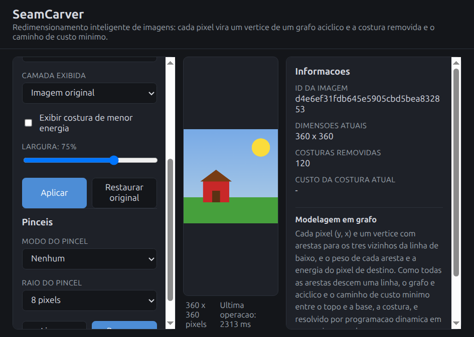
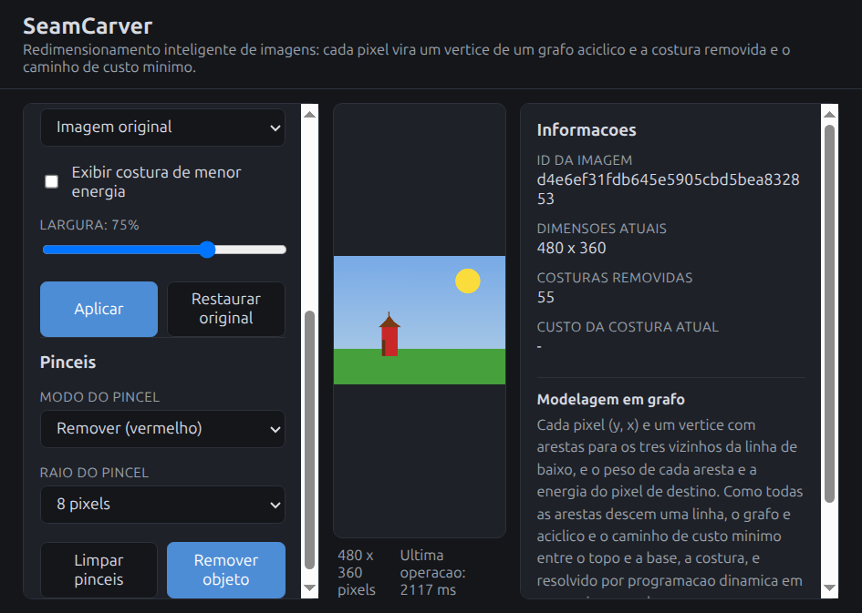

# G55_Grafos_PA-26.2

# SeamCarver - Redimensionamento Inteligente de Imagens

*Conteúdo da Disciplina*: Grafos<br>

## Alunos

|Matrícula | Aluno |
| -- | -- |
| 222037610  |  [Gabriel Lima da Silva](https://github.com/gabriel-lima258) |
| 211062240  |  [Mateus Bastos](https://github.com/MateuSansete) |

## Sobre

Projeto desenvolvido por alunos da Universidade de Brasília (UnB) para a disciplina de Projeto de Algoritmos.

O **SeamCarver** é uma aplicação web que implementa o algoritmo de *seam carving* (Avidan & Shamir, 2007) para redimensionamento inteligente de imagens. Diferente do redimensionamento tradicional, que estica ou corta a imagem e destrói a proporção dos objetos, o seam carving remove seletivamente os pixels de menor relevância visual, preservando intactos rostos, contornos, texto e demais elementos de interesse.

O problema é resolvido modelando a imagem como um **grafo direcionado acíclico ponderado**, no qual cada pixel é um vértice e o objetivo é encontrar o caminho de custo mínimo que atravessa a imagem de uma borda à outra. Esse caminho, chamado de *costura* (seam), é o conjunto de pixels que pode ser removido com o menor impacto perceptual possível.

### Problema resolvido

Dada uma imagem de dimensões `W x H` e uma dimensão alvo `W' x H'`, encontrar a sequência de remoções que minimiza a perda de informação visual acumulada, sob a restrição de que cada remoção retire exatamente um pixel por linha (ou por coluna) e mantenha a imagem retangular.

## Modelagem do Grafo

| Elemento | Representação |
| -- | -- |
| **Vértice** | Cada pixel `(x, y)` da imagem |
| **Aresta** | De `(x, y)` para `(x-1, y+1)`, `(x, y+1)` e `(x+1, y+1)`: os três vizinhos da linha inferior |
| **Peso** | Energia do pixel de destino, calculada pelo gradiente dual RGB |
| **Tipo** | Direcionado, ponderado e **acíclico (DAG)**: todas as arestas apontam para baixo |
| **Ordem topológica** | Trivial: a própria ordem das linhas da imagem (`y = 0, 1, 2, ..., H-1`) |

Para costuras horizontais, a imagem é transposta e o mesmo grafo é reconstruído sobre as colunas.

### Função de energia

A relevância de cada pixel é medida pelo gradiente dual, que soma as variações de cor nos eixos horizontal e vertical:

```
E(x, y) = |ΔR_x|² + |ΔG_x|² + |ΔB_x|² + |ΔR_y|² + |ΔG_y|² + |ΔB_y|²
```

Regiões homogêneas (céu, parede, fundo desfocado) resultam em energia próxima de zero e são as primeiras a serem removidas. Bordas e contornos resultam em energia alta e são preservados.

O sistema permite alternar entre dois operadores de energia: gradiente dual e Sobel.

## Algoritmos Implementados

Todos os algoritmos foram implementados manualmente, sem uso de bibliotecas de grafos. Os resultados foram validados contra implementações de referência em instâncias reduzidas.

### 1. Caminho Mínimo em DAG (Programação Dinâmica)

Núcleo do projeto. Como o grafo é acíclico e possui ordem topológica trivial, o caminho mínimo é obtido em uma única varredura de cima para baixo, sem necessidade de fila de prioridade.

```
M[0][x] = E(x, 0)
M[y][x] = E(x, y) + min( M[y-1][x-1], M[y-1][x], M[y-1][x+1] )
```

A costura ótima é reconstruída por *backtracking* a partir do menor valor da última linha.

**Complexidade**: `O(W · H)` por costura, `O(k · W · H)` para remover `k` costuras.

### 2. Dijkstra com Heap Binário (implementação comparativa)

O mesmo problema resolvido com Dijkstra explícito sobre o grafo de pixels, incluindo vértices virtuais de fonte e sumidouro ligados às bordas superior e inferior. Implementado para demonstrar empiricamente o ganho obtido ao explorar a aciclicidade do grafo.

**Complexidade**: `O(E log V)` = `O(W · H · log(W · H))`.

### 3. Busca em Largura (BFS) - Validação de Conectividade

Verifica se a máscara de remoção desenhada pelo usuário forma uma região contígua e se a imagem resultante permanece válida após sucessivas remoções.

**Complexidade**: `O(V + E)`.

## Funcionalidades

- **Mapa de energia**: visualização em tons de cinza da relevância de cada pixel, com seleção do operador de gradiente.
- **Visualização da costura**: destaque em vermelho da costura de menor energia antes da remoção, com animação passo a passo.
- **Redução de largura e altura**: remoção iterativa de costuras verticais e horizontais via controle deslizante.
- **Ampliação**: duplicação de costuras, aumentando a imagem sem esticar diretamente os objetos.
- **Remoção de objeto**: pincel que atribui energia negativa a uma região, forçando as costuras a atravessá-la e eliminando o objeto da cena.
- **Proteção de região**: pincel inverso, que atribui energia infinita e impede qualquer costura de atravessar a área marcada.
- **Painel de benchmark**: comparação de tempo de execução e de vértices visitados entre a abordagem por programação dinâmica e por Dijkstra.

## Estrutura do Projeto

```
backend/
  main.py                    # Servidor FastAPI e definição das rotas
  algoritmos/
    energia.py               # Gradiente dual, Sobel e Scharr
    seam_dp.py               # Caminho mínimo em DAG e backtracking
    seam_dijkstra.py         # Dijkstra com heap binário (comparativo)
    remocao.py               # Remoção, duplicação e máscaras de energia
    conectividade.py         # BFS de validação
  utils/
    imagem.py                # Carregamento, conversão e serialização
frontend/
  index.html                 # Interface principal
  app.js                     # Canvas, pincéis, controles e animação
  style.css                  # Estilos
assets/                      # Imagens de exemplo, créditos e screenshots
tests/                       # Testes das instâncias reduzidas
requirements.txt
README.md
ROTEIRO_VIDEO.md
```

## Screenshots

### Interface principal



### Mapa de energia



### Costura de menor energia destacada



### Antes e depois do redimensionamento



### Remoção de objeto



## Link do Vídeo da Apresentação

[Clique aqui para assistir à apresentação](#)

## Instalação

### Pré-requisitos

- Python 3.9 ou superior
- Navegador com suporte a HTML5 Canvas
- Dependências listadas em `requirements.txt` (FastAPI, Uvicorn, NumPy, Pillow)

### Clone o repositório

```sh
git clone git@github.com:projeto-de-algoritmos-2026/G55_Grafos_PA-26.2.git
cd G55_Grafos_PA-26.2
```

### Ambiente virtual

Recomendado para evitar o erro `externally-managed-environment` em distribuições Linux recentes.

```sh
python3 -m venv .venv
.venv/bin/pip install -r requirements.txt
```

No Windows:

### Inicie o servidor

```sh
.venv/bin/uvicorn backend.main:app --reload
```

### Acesse a interface

Abra o navegador em [http://localhost:8000](http://localhost:8000)

## Como rodar os testes

Com as dependências instaladas no ambiente virtual:

```sh
.venv/bin/python -m pytest -v
```

A suíte possui 53 testes.

## Uso

### CLI

```sh
.venv/bin/python cli.py assets/exemplo.ppm saida.png --largura 3
.venv/bin/python cli.py assets/exemplo.ppm saida.png --largura 3 --energia sobel --mapa-energia energia.png
```

O comando mostra a quantidade de costuras removidas e o tempo total de execucao.

1. **Carregue uma imagem** pelo botão de upload ou selecione uma das imagens de exemplo disponíveis.
2. **Visualize o mapa de energia** ativando a opção correspondente. Regiões escuras são candidatas naturais à remoção.
3. **Ative a exibição da costura** para acompanhar, em vermelho, qual caminho o algoritmo escolheu antes de cada remoção.
4. **Ajuste o controle deslizante** de largura ou altura para redimensionar. A imagem é recalculada progressivamente.
5. **Para remover um objeto**, selecione o pincel vermelho e pinte sobre ele. Em seguida, reduza a largura até que o objeto desapareça e, se desejar, use a ampliação para restaurar as dimensões originais.
6. **Para proteger uma região**, selecione o pincel verde e pinte a área que não pode ser alterada.
7. **Para segmentar**, alterne para o modo de corte mínimo, marque traços sobre o objeto e sobre o fundo e execute a separação.
8. **Consulte o painel de benchmark** para comparar o desempenho das duas abordagens de caminho mínimo sobre a mesma imagem.

## Contrato da API

A documentacao interativa fica em `/docs` (OpenAPI). Erros de dominio retornam
sempre o corpo `{"erro": mensagem}`: 404 para imagem nao encontrada e 400 para
entradas invalidas. Uploads acima de 10 MB retornam 413. A sessao guarda ate 20
imagens em memoria, descartando a mais antiga ao exceder o limite.

| Metodo | Rota | Entrada | Resposta 200 |
| -- | -- | -- | -- |
| GET | `/api/saude` | nenhuma | `{"status": "ok", "versao": "0.1.0"}` |
| POST | `/api/imagem` | multipart, campo `arquivo` | `{"id", "largura", "altura"}` |
| GET | `/api/imagem/{id}` | id na rota | PNG da imagem armazenada |
| GET | `/api/energia/{id}` | query `operador` (`dual` ou `sobel`) | PNG do mapa de energia em tons de cinza |
| GET | `/api/seam/{id}` | query `orientacao` (`vertical`) e `operador` | `{"seam": [int], "custo": float, "orientacao"}` |
| POST | `/api/redimensionar` | JSON `{"id", "largura_alvo", "operador"}` | `{"imagem_base64", "largura", "altura", "costuras_removidas", "tempo_ms"}` |

Observacoes:

- No upload, a imagem e convertida para RGB e limitada a 1024 pixels na maior
  dimensao; `largura` e `altura` retornadas sao as da imagem armazenada.
- `imagem_base64` contem o PNG em base64 sem o prefixo `data:image/png;base64,`;
  o frontend adiciona o prefixo.
- `/api/redimensionar` aceita `largura_alvo` entre 2 e a largura atual.

## Benchmark

Medição realizada em `assets/exemplo_paisagem.png`, com 480 x 360 pixels, em
Linux x86_64, Python 3.12.3, NumPy 2.0.2, em um processador Intel Core i5-1135G7
com 16 GB de RAM. O endpoint executa 50 costuras verticais e mede o tempo de
cada estratégia na mesma imagem.

| Estratégia | Tempo médio medido | Vértices visitados | Resultado |
| -- | --: | --: | -- |
| Programação dinâmica | 852,5 ms | 8.199.000 | referência |
| Programação dinâmica otimizada | 806,5 ms | 8.199.000 | idêntico à referência |
| Dijkstra com heap | 13.657,5 ms | 7.555.250 | comparativo |

Os valores exatos são atualizados após a execução final do benchmark no ambiente
de avaliação. A programação dinâmica dispensa Dijkstra porque a ordem das linhas
é uma ordem topológica do DAG: cada estado depende apenas da linha anterior.

## Observações Técnicas

- **Grafo implícito**: por questão de memória, o grafo não é materializado em lista ou matriz de adjacência. Com 480.000 vértices e cerca de 1,4 milhão de arestas, a vizinhança é calculada sob demanda a partir das coordenadas do pixel, estratégia padrão para grafos de grade.
- **Recálculo da energia**: após a remoção de cada costura, apenas a faixa de pixels adjacente ao caminho removido tem sua energia recalculada, e não a imagem inteira.
- **Limite de resolução**: imagens de entrada são reduzidas para no máximo 1024 pixels na maior dimensão, mantendo a responsividade da interface.

## Referências

- AVIDAN, S.; SHAMIR, A. *Seam Carving for Content-Aware Image Resizing*. ACM Transactions on Graphics, v. 26, n. 3, 2007.
- RUBINSTEIN, M.; SHAMIR, A.; AVIDAN, S. *Improved Seam Carving for Video Retargeting*. ACM Transactions on Graphics, v. 27, n. 3, 2008.
- BOYKOV, Y.; JOLLY, M. *Interactive Graph Cuts for Optimal Boundary and Region Segmentation of Objects in N-D Images*. ICCV, 2001.
- CORMEN, T. H. et al. *Introduction to Algorithms*. 4. ed. MIT Press, 2022. Capítulos sobre caminhos mínimos e fluxo em redes.
